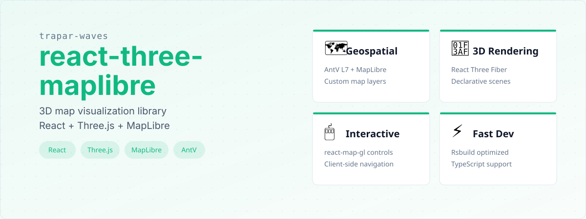
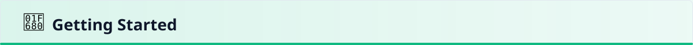
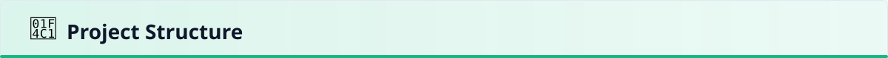
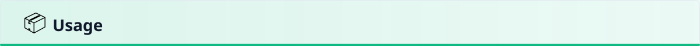
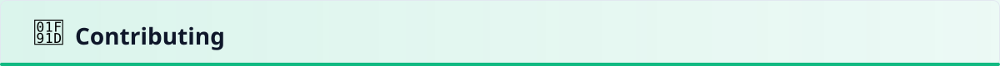
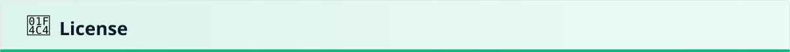

# @trapar-waves/react-three-maplibre


---

[English](../README.md) | [中文](./README-CN.md) | [Русский язык](./README-RU.md)

> Three.js、MapLibre、AntV を統合した React ベースのライブラリで、高度な地理空間 3D 可視化を実現します。




- **地理空間可視化：** `@antv/l7` と `maplibre-gl` を組み合わせ、カスタムマップレイヤーを使用した強力な地理空間データレンダリングを実現します。
- **React による 3D レンダリング：** `@react-three/fiber` と `@react-three/drei` を活用し、Three.js を React ベースのワークフローに統合し、宣言型 3D シーン管理を実現します。
- **カスタマイズ可能な UI 統合：** React（`react`、`react-dom`）とのシームレスな統合を提供し、インタラクティブな地理空間アプリケーションを構築します。
- **ユーティリティファーストのスタイリング：** `tailwindcss` を採用し、コンポーネントとレイアウトの柔軟で迅速なスタイリングを実現します。
- **型安全性：** TypeScript を使用して型安全性を確保し、開発中の開発者エクスペリエンスを向上させます。
- **高速開発ワークフロー：** `rsbuild` を活用して最適化されたビルドと効率的な開発サーバーパフォーマンスを実現します。
- **充実したコンポーネントライブラリ：** `three-stdlib` および `@react-three/drei` と統合し、再利用可能な Three.js ユーティリティとコンポーネントを提供します。
- **マップインタラクティビティ：** `react-map-gl` を実装し、地理空間コンテキストにおけるインタラクティブなマップコントロールとクライアント側ナビゲーションを提供します。
- **AntV 拡張機能：** `@antv/l7-maps` を組み込み、追加のマップレイヤリング機能と可視化ツールを提供します。


- **フレームワーク/ライブラリ：** `React`
- **UI ツールキット/スタイリング：** `Tailwind CSS`
- **3D レンダリング：** `Three.js`（`@react-three/fiber`、`@react-three/drei`）
- **地理空間ライブラリ：** `MapLibre GL`、`AntV L7`
- **ビルドツール：** `Rsbuild`
- **言語：** `TypeScript`

依存関係の完全なリストについては [package.json](../package.json) を参照してください。



## 前提条件

- Node.js（>= 18.x 推奨）
- パッケージマネージャー（npm、yarn、または pnpm）

### インストール

1. テンプレートを使用して新しいプロジェクトを作成：

   ```bash
   pnpm create trapar-waves
   ```

2. プロジェクトディレクトリに移動し、依存関係をインストール：

   ```bash
   pnpm install
   ```

3. 開発サーバーを起動：

   ```bash
   pnpm dev
   ```



```
├── public/             # 静的アセット
├── src/                # ソースコード
│   ├── App.tsx         # メインアプリケーションコンポーネント
│   └── index.tsx       # エントリーポイント
├── rsbuild.config.ts   # Rsbuild 設定
├── tsconfig.json       # TypeScript 設定
├── eslint.config.js    # ESLint 設定
└── package.json        # プロジェクトの依存関係とスクリプト
```



このライブラリは、地理空間 3D 可視化アプリケーションを作成するためのテンプレートとして設計されています。React、Three.js、MapLibre GL、AntV L7 を使用した基本的なセットアップを提供します。

### 基本的な例

このテンプレートが提供するコンポーネントの使用方法の簡単な例を以下に示します：

```tsx
// App.tsx
import type { ReactNode } from "react";
import type { MapRef } from "react-map-gl/maplibre";
import { PointLayer, Scene } from "@antv/l7";
import { MapLibre } from "@antv/l7-maps";
import { Box, Stats } from "@react-three/drei";
import { extend } from "@react-three/fiber";
import { useRef } from "react";
import Map from "react-map-gl/maplibre";
import { Canvas } from "react-three-map/maplibre";
import { LineMaterial, LineSegments2, LineSegmentsGeometry } from "three-stdlib";

extend({ LineSegmentsGeometry, LineMaterial, LineSegments2 });

declare module "@react-three/fiber" {
  interface ThreeElements {
    lineSegmentsGeometry: ThreeElements["bufferGeometry"];
    lineMaterial: ThreeElements["material"] & Partial<LineMaterial>;
    lineSegments2: ThreeElements["object3D"] & { children?: ReactNode };
  }
}

const latLon = {
  latitude: 31.215175,
  longitude: 121.417463,
};
const MAP_STYLE_URL
  = "https://basemaps.cartocdn.com/gl/dark-matter-gl-style/style.json";

function App() {
  const ref = useRef<HTMLDivElement>(null!);
  const mapRef = useRef<MapRef>(null!);
  function initL7() {
    if (mapRef.current) {
      const scene = new Scene({
        id: "map",
        map: new MapLibre({
          mapInstance: mapRef.current.getMap(),
        }),
      });
      scene.on("loaded", () => {
        fetch("/BElVQFEFvpAKzddxFZxJ.txt")
          .then(res => res.text())
          .then((data) => {
            const pointLayer = new PointLayer({
              blend: "additive",
            })
              .source(data, {
                parser: {
                  type: "csv",
                  y: "lat",
                  x: "lng",
                },
              })
              .size(0.5)
              .color("#080298");

            scene.addLayer(pointLayer);
          });
      });
    }
  }
  return (
    <div className="h-screen w-screen relative overflow-hidden" ref={ref}>
      <Map
        id="map"
        ref={mapRef}
        initialViewState={{
          ...latLon,
          zoom: 11,
          pitch: 64.88,
        }}
        mapStyle={MAP_STYLE_URL}
        onLoad={initL7}
      >
        <Stats className="stats" parent={ref} />

        <Canvas {...latLon}>
          <hemisphereLight
            args={["#ffffff", "#60666C"]}
            position={[1, 4.5, 3]}
          />
          <object3D scale={500}>
            <Box position={[-1.2, 1, 0]} />
            <Box position={[1.2, 1, 0]} />
          </object3D>
        </Canvas>
      </Map>
    </div>
  );
}

export default App;
```

この例では以下を示しています：

- `react-map-gl` を使用して MapLibre GL マップを作成する
- 地理空間データの可視化のために AntV L7 を統合する
- 3D レンダリングのために React Three Fiber と Drei を使用する
- `react-three-map` を使用して 3D オブジェクトをマップに対して配置する

### 地図のベースマップ

テンプレートは API キー不要の Carto GL スタイル（`src/App.tsx` の `MAP_STYLE_URL`）を既定とします。MapTiler など別プロバイダへ切り替える場合は `mapStyle` を変更し、`.env` / CI で鍵を管理してください。



コントリビュートを歓迎します！以下の手順に従ってコントリビュートしてください：

1. リポジトリをフォーク
2. 機能ブランチを作成（`git checkout -b feature/amazing-feature`）
3. 変更をコミット（`git commit -m 'Add some amazing feature'`）
4. ブランチにプッシュ（`git push origin feature/amazing-feature`）
5. Pull Request を作成



MIT License © 2025 Trapar Waves

## 👤 作者

- **Rikka：** [admin@rikka.cc](mailto:admin@rikka.cc)
- **GitHub プロフィール：** [Muromi-Rikka](https://github.com/Muromi-Rikka)

## 🔗 リンク

- **リポジトリ：** [https://github.com/Trapar-waves/react-three-maplibre](https://github.com/Trapar-waves/react-three-maplibre)
- **Issues：** [https://github.com/Trapar-waves/react-three-maplibre/issues](https://github.com/Trapar-waves/react-three-maplibre/issues)
